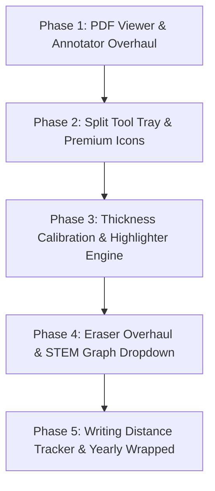

# PRSNL Notes App: Comprehensive Diagnostics, Architecture & Feature Specification

## 1. Executive Summary

This document captures the in-depth technical diagnosis of the current hurdles facing the **PRSNL Notes App** for Android, along with detailed architectural specifications for the proposed solutions, redesigns, and new capabilities (including the **Stylus Writing Distance Tracker** and **Yearly "Notes Wrapped"** experience).

---

## 2. Issue 1: PDF Viewer & Annotator Breakdown

### 2.1 Root Cause of Blank Pages & Errant Behavior
1. **The Native `PdfRenderer` Fallback Trap**:
   - In [`PdfImporter.kt`](file:///Users/paramkhodiyar/notes/pdf/src/main/java/com/prsnl/pdf/PdfImporter.kt), PDFs are loaded via Android's native `android.graphics.pdf.PdfRenderer`.
   - Android's native `PdfRenderer` fails (throws exceptions or security errors) when opening encrypted documents, PDFs with compressed cross-reference tables, non-standard embedded fonts, or complex vector streams.
   - When an exception occurs, the code falls back to `createEmergencyFallbackNotebook()`, which generates a **single blank white image with the text `"PDF Page 1 Markup Canvas"`**. This explains why the app randomly opens a single blank page.
2. **Pre-rendering Entire PDFs to PNGs on Disk**:
   - `PdfImporter` attempts to render every page into a PNG file up to 2400px dimension in `context.filesDir/pdf_imports/<notebookId>/page_X.png`.
   - For a document of 20–100 pages, this causes heavy CPU thrashing, massive storage consumption (hundreds of megabytes), and sudden `OutOfMemoryError` crashes during import.
   - In [`BackgroundRenderer.kt`](file:///Users/paramkhodiyar/notes/drawing/src/main/java/com/prsnl/drawing/render/BackgroundRenderer.kt), if any generated PNG file is missing or fails to decode, it calls `drawPdfUnavailable()`, rendering a blank canvas.
3. **Gesture Collisions in Compose**:
   - In [`PdfReaderScreen.kt`](file:///Users/paramkhodiyar/notes/ui/src/main/java/com/prsnl/ui/pdf/PdfReaderScreen.kt), pages are placed in a Compose `LazyColumn` containing an `AndroidView(DrawingCanvasView)`.
   - The outer `LazyColumn` intercepts `ACTION_MOVE` touch events when writing or annotating, cutting off stylus strokes midway and preventing smooth drawing.
   - There is no native support for smooth pinch-to-zoom or two-finger panning across pages.

### 2.2 Recommended Solution: Integration with a Battle-Tested PDF Engine
Instead of writing a custom PDF rasterizer and page streamer from scratch, we recommend using a mature, optimized PDF rendering library:

- **Primary Recommendation: `AndroidPdfViewer` (Pdfium-based)**
  - **Dependency**: `com.github.mhiew:android-pdf-viewer` or `io.github.afreakk:PdfiumAndroid`.
  - **Benefits**:
    - Powered by Google's **Pdfium** engine (the engine used by Google Chrome).
    - Streams pages on-demand without pre-converting the whole PDF into PNGs.
    - Handles encryption, annotations, bookmarks, and complex vector streams.
    - Built-in multi-touch zoom (pinch-to-zoom up to 10x), smooth horizontal or vertical continuous scroll, and page snapping.
  - **Annotation Architecture**:
    - Keep the PDF page rendering inside the PDF viewer.
    - Overlay a transparent `DrawingCanvasView` on top of the active page view.
    - Synchronize the canvas matrix (pan offset and zoom scale) with the PDF viewer's zoom matrix so annotations remain perfectly aligned when zoomed or scrolled.
    - When exporting, render the PDF pages together with the vector strokes into an annotated PDF using `PdfDocument` or Pdfium.

---

## 3. Issue 2: Tool Tray Architecture (Split Tray Design)

### 3.1 Current Problem
- All controls (Pen, Pencil, Lasso, Typer, Shapes, Eraser, Settings, Submenus, Sliders, and Color dots) are packed into a single floating draggable `FloatingWritingToolbar`.
- It continuously covers notes, collides with the user's hand/palm, and nested submenus collapse or conflict during fast writing.

### 3.2 Target Solution: Split Tray Architecture
Split the interface into two coordinated components:

```
+---------------------------------------------------------------------------------------+
|  [<] Notebook Name   |  [Pen] [Highlighter] [Pencil] [Eraser] | [Shapes] [Graphs v]   |
|                      |  [Lasso] [Text] [Image]               | [Undo] [Redo] [Gear]  |
+---------------------------------------------------------------------------------------+
|                                                                                       |
|                                                                                       |
|                                CANVAS AREA                                            |
|                                                                                       |
|                                                                                       |
|                                                          +-------------------------+  |
|                                                          | [P] [E] | (*) (*) (*)   |  |
|                                                          |  Toggle |  Quick Colors |  |
|                                                          +-------------------------+  |
+---------------------------------------------------------------------------------------+
```

1. **Fixed Top Bar (Responsive for Portrait & Landscape)**:
   - Docked at the top of the screen (adapts neatly to tablet landscape and phone portrait).
   - Contains the comprehensive toolset:
     - Primary Writing Tools: Pen, Highlighter, Pencil.
     - Correction Tools: Eraser (with mode dropdown: Stroke / Segment / Whole Element).
     - Construction Tools: Shapes Palette, **Dedicated STEM Graph Dropdown**.
     - Manipulation Tools: Lasso Selection, Text Typer, Insert Image.
     - Document Actions: Undo, Redo, Page Navigator, Notebook Settings, Export PDF.
2. **Hovering Quick-Action Tool (Floating Mini-Pill)**:
   - Draggable, compact pill with magnetic edge-snapping (docks to bottom-right or bottom-left).
   - Designed for high-speed writing without reaching to the top bar:
     - **1-Tap Tool Toggle**: Instantly toggles between the active drawing tool (Pen/Highlighter) and the Eraser.
     - **3 Quick Color Dots**: Last 3 chosen colors for fast switching.
     - **Quick Thickness Indicator**: Visual dot showing current stroke width.
     - **Quick Undo**: One-tap instant undo.

---

## 4. Issue 3: Thickness Selector Calibration

### 4.1 Root Cause
- Currently, [`FloatingWritingToolbar.kt`](file:///Users/paramkhodiyar/notes/ui/src/main/java/com/prsnl/ui/editor/FloatingWritingToolbar.kt) uses a single continuous slider from `2f` to `24f`.
- In [`StrokeRenderer.kt`](file:///Users/paramkhodiyar/notes/drawing/src/main/java/com/prsnl/drawing/render/StrokeRenderer.kt), this is scaled by `(0.6f + 0.8f * meanPressure)`.
- At the slider midpoint (~13px) with normal stylus pressure, the line width explodes to **~20.3 pixels**, rendering notes illegible. Users have to keep the slider at the absolute minimum setting.

### 4.2 Calibrated Specifications
Each tool must have its own calibrated physical thickness scale and quick-select presets:

| Tool | Dynamic Range | Default | Quick-Select Presets |
| :--- | :--- | :--- | :--- |
| **Pen (Ballpoint / Fountain)** | `0.8 dp` – `4.5 dp` | `1.8 dp` | `0.35 mm` (Fine), `0.5 mm` (Normal), `0.7 mm` (Medium), `1.0 mm` (Bold) |
| **Pencil** | `1.0 dp` – `6.0 dp` | `2.2 dp` | `0.5 mm` (HB), `0.7 mm` (2B), `1.2 mm` (4B) |
| **Highlighter** | `8.0 dp` – `36.0 dp` | `18.0 dp` | `12 dp` (Fine line), `18 dp` (Text match), `28 dp` (Broad chisel) |
| **Eraser** | `12.0 dp` – `80.0 dp` | `32.0 dp` | `16 dp` (Precision), `32 dp` (Normal), `64 dp` (Block wipe) |

Users will have 3 quick-tap preset circles directly on the UI, plus a fine-tuning slider when long-pressed.

---

## 5. Issue 4: Highlighter Engine & Limited Multi-Color Palette

### 5.1 Identified Problems
1. **Missing UI**: `CanvasToolMode.HIGHLIGHTER` exists in the codebase but has no button or entry point in the main toolbar.
2. **Alpha Darkening Bug**: Currently rendered with `strokePaint.alpha = 110`. When strokes overlap or turn corners, the semi-transparent layers multiply and turn dark/muddy, obscuring text rather than highlighting it.

### 5.2 Curated Highlighter Palette
Eliminate the complex hex color wheel in favor of a curated, high-contrast palette:

#### Neon Fluorescent Shades:
- **Neon Yellow**: `#DFFF00` / `#F3FA18`
- **Neon Green**: `#39FF14` / `#55FF55`
- **Neon Pink**: `#FF1493` / `#FF2A85`
- **Neon Cyan / Electric Blue**: `#00F0FF` / `#38BDF8`
- **Neon Orange**: `#FF6B00` / `#FF8C00`

#### Soft Pastel Shades:
- **Pastel Lavender**: `#C084FC`
- **Soft Coral / Peach**: `#FCA5A5`
- **Mint Mist**: `#86EFAC`
- **Soft Buttercup**: `#FDE047`
- **Muted Sky**: `#7DD3FC`

### 5.3 Rendering Improvement
- Use `Paint.setXfermode(PorterDuffXfermode(PorterDuff.Mode.MULTIPLY))` so the highlight color stains the page background without darkening existing ink into black.
- Ensure highlighters are drawn on a layer beneath committed pen strokes.

---

## 6. Issue 5: Premium Dedicated Icon Pack & Dynamic Color-Accurate Nibs

### 6.1 Current Problem
Current icons use generic Material Design glyphs:
- Pen: Generic pencil icon (`Icons.Default.Create`)
- Pencil: Duplicate pencil icon (`Icons.Default.Edit`)
- Lasso: **Mechanic's wrench/spanner** (`Icons.Default.Build`)
- Shapes: Star icon (`Icons.Default.Star`)
- Eraser: **Close / "X" cancel button** (`Icons.Default.Clear`)

### 6.2 Custom Vector Artwork Specifications
Handcrafted, vector-drawn icons for each tool:

1. **Fountain / Studio Pen**:
   - Detailed metal casing with polished collar and classic fountain nib.
   - **Dynamic Nib**: The triangular tip and ink channel dynamically render in the user's selected ink color (e.g., royal blue, crimson, emerald).
2. **Chisel-Tip Highlighter**:
   - Broad marker barrel with distinct translucent cap styling and slanted chisel tip.
   - **Dynamic Chisel Tip**: Glowing neon/pastel color matching the active highlighter shade.
3. **Wooden Pencil**:
   - Hexagonal wooden body with sharpened cedar collar and graphite/colored core.
   - **Dynamic Lead**: The sharpened tip reflects the active pencil color.
4. **Classic Block Eraser**:
   - Angled eraser block with sleeve band.
5. **Precision Lasso**:
   - Elegant looped lasso rope with marching dashed selection indicator.
6. **STEM Graph Tool**:
   - Stylized Cartesian coordinate frame $(x, y)$ with an intersecting curve or function wave.

---

## 7. Issue 6: Eraser Usability & Precision Flaws

### 7.1 Identified Defects
1. **No Visual Cursor**: The canvas never draws an eraser ring. Users cannot see where the eraser is touching or how large the radius is.
2. **Undo History Flooding**: An undo command is issued on every touch event during a drag, spamming the stack with dozens of tiny actions for a single stroke.
3. **Missing Point-to-Segment Collision**: Fast swipes jump over points, leaving line segments unerased.

### 7.2 Eraser Upgrades
1. **Live Circular Reticle**: Render a subtle frosted circle (with crosshair center) showing the exact active eraser radius under the stylus tip.
2. **Segment-Based Hit Testing**: Calculate distance from touch point to the line segments $(P_i, P_{i+1})$, ensuring 100% reliable erasure even during fast stylus flicks.
3. **Batched Stroke Commands**: Group all erased elements during a continuous touch gesture into a single `CompositeCommand` on `ACTION_UP`, so a single tap on Undo restores the entire swipe.

---

## 8. Issue 7: STEM Graph Tool & Shape System

### 8.1 Dedicated Top-Bar Graph Dropdown
A dedicated **"Graph"** button on the top tray opens a specialized STEM menu:

1. **Cartesian 2D (Quadrant I)**:
   - Perpendicular positive $X$ and $Y$ axes with directional arrows and optional tick marks. Ideal for kinematics, economics, and experimental data.
2. **Full Cartesian Grid (4 Quadrants)**:
   - Centered origin $(0, 0)$ with labeled axes, customizable axis ticks, and light coordinate grid.
3. **3D Coordinate Frame ($X, Y, Z$)**:
   - Isometric/perspective axes for multivariable calculus, 3D vectors, and physics.
4. **Polar Coordinate System**:
   - Concentric radius rings $(r = 1, 2, 3...)$ with radial angle rays ($0^\circ, 30^\circ, 45^\circ, 60^\circ, 90^\circ...$).
5. **Number Line**:
   - Single horizontal axis with bidirectional arrows and evenly spaced hash marks.
6. **Logarithmic / Semi-Log Grid**:
   - Decade-spaced grid lines for frequency response, exponential decay, and decibel plots.

### 8.2 Production-Ready Geometric & Scientific Shapes
- **Polygon Suite**: Equilateral Triangle, Right Triangle (with $90^\circ$ angle square), Pentagon, Regular Hexagon (essential for organic chemistry benzene rings).
- **3D Solids**: Isometric Cube, Cylinder with elliptical bases, Sphere with dashed equator line.
- **STEM Annotations**: Equation Grouping Braces `{ }`, Vector Arrowheads, Dimension Callout Lines with distance arrows.

---

## 9. Feature: Stylus Writing Distance Tracker, Stats & Yearly "Notes Wrapped"

### 9.1 Concept Overview
Track how far the user's stylus has traveled across the screen in **real-world physical distance (meters and kilometers)**, providing engaging statistics, personal productivity insights, and a Spotify Wrapped-style **"Notes Wrapped"** yearly celebration.

### 9.2 Physical Distance Calculation Math
Screen coordinates are in pixels. To calculate real-world physical distance:
1. Obtain device display metrics:
   $$\text{xdpi} = \text{context.resources.displayMetrics.xdpi}$$
   $$\text{ydpi} = \text{context.resources.displayMetrics.ydpi}$$
2. For each consecutive pair of points $(p_1, p_2)$ in a stroke:
   $$\Delta x_{\text{in}} = \frac{|p_2.x - p_1.x|}{\text{xdpi}}, \quad \Delta y_{\text{in}} = \frac{|p_2.y - p_1.y|}{\text{ydpi}}$$
   $$\text{distance}_{\text{inches}} = \sqrt{\Delta x_{\text{in}}^2 + \Delta y_{\text{in}}^2}$$
   $$\text{distance}_{\text{meters}} = \text{distance}_{\text{inches}} \times 0.0254$$
3. Distance is calculated in the background upon `ACTION_UP` and stored incrementally.

### 9.3 Data Architecture & Storage
A dedicated Room database table in the `:storage` module:

```kotlin
@Entity(tableName = "writing_stats")
data class WritingStatEntity(
    @PrimaryKey val id: String, // UUID
    val timestampMs: Long,
    val notebookId: String,
    val folderName: String,
    val distanceMeters: Double,
    val strokeCount: Int,
    val toolUsed: String, // PEN, PENCIL, HIGHLIGHTER
    val colorHex: String,
    val durationMs: Long
)
```

Fast pre-aggregated daily summaries (`DailyWritingSummaryEntity`) ensure instant loading of the stats dashboard without recalculating millions of points.

### 9.4 Stats Screen Capabilities
A dedicated **"Notebook Analytics & Stats"** screen accessible from Home settings:
1. **Odometer Widget**:
   - Total meters and kilometers written (e.g., *"142.8 meters written"*).
   - **Real-World Milestones**: Fun comparisons:
     - $50\text{ m}$: *"You've written the length of an Olympic swimming pool!"*
     - $324\text{ m}$: *"Height of the Eiffel Tower!"*
     - $8,848\text{ m}$: *"You've climbed Mount Everest with your stylus!"*
2. **Notebook & Folder Leaderboard**:
   - Top notebooks by distance and time spent (e.g., `Physics II: 48.2m`, `Calculus: 32.1m`).
   - Most active folder breakdown (e.g., `University: 68%`, `Personal: 22%`).
3. **Writing Velocity & Tool Insights**:
   - Total stroke count and average writing speed (cm/sec).
   - Tool usage breakdown pie chart: Pen vs. Highlighter vs. Pencil.
   - Favorite ink colors (e.g., `Royal Blue: 52%`, `Neon Yellow: 28%`).

### 9.5 The Yearly "Notes Wrapped" Experience
An engaging, full-screen animated story (tap to advance, with sound/haptics and shareable export cards) generated at year-end or on-demand:

- **Slide 1: The Distance Milestone**:
  - *"In 2026, your stylus traveled 1,420 meters across your screen."*
- **Slide 2: The Go-To Subject**:
  - *"Your most-loved notebook was **Advanced Organic Chemistry** with 412 meters across 64 pages."*
- **Slide 3: Peak Productivity**:
  - *"You were on fire in **October**. Your most productive day was **Tuesday, Oct 14**, writing 38 meters in one night."*
- **Slide 4: The Color Palette of Your Year**:
  - Breakdown of ink colors used, featuring your personal signature shade.
- **Slide 5: Your Stylus Persona**:
  - Dynamic personality badges based on writing habits:
    - *"The Neon Scholar"* (Highlighter > 40% of strokes)
    - *"The STEM Architect"* (Frequent Graph & Shape usage)
    - *"The Minimalist Scribe"* (Pen only, ultra-fine 0.35mm strokes)
- **Slide 6: Shareable Card**:
  - Generates a beautifully formatted graphic summarizing the user's year, ready to export as an image or share.

---

## 10. Phased Implementation Roadmap



1. **Phase 1: PDF Viewer & Annotator Overhaul**:
   - Integrate `AndroidPdfViewer` (Pdfium) for streaming PDF rendering.
   - Remove destructive upfront PNG pre-rendering.
   - Implement synchronized annotation overlay with pinch-to-zoom and two-finger pan.
2. **Phase 2: Split Tool Tray & Premium Vector Icons**:
   - Implement fixed top navigation bar across portrait and landscape.
   - Implement compact floating quick-action pill (1-tap pen/eraser toggle, quick colors).
   - Design custom vector icons with real-time dynamic color-accurate nibs.
3. **Phase 3: Thickness Calibration & Highlighter Engine**:
   - Re-scale pen stroke widths to realistic 0.35mm–1.0mm ranges with discrete preset chips.
   - Add dedicated Highlighter tool with curated Neon and Pastel palettes.
   - Apply Multiply blend mode to prevent muddy stroke overlaps.
4. **Phase 4: Eraser Usability & STEM Graph Suite**:
   - Add live circular eraser reticle and segment-based hit detection.
   - Batch erase operations into single undo commands.
   - Build dedicated Top Bar Graph dropdown (Cartesian 1Q/4Q, 3D, Polar, Number Line) and expanded STEM shapes.
5. **Phase 5: Stylus Distance Tracker & Yearly Wrapped**:
   - Add DPI-based physical distance calculation on stroke completion.
   - Create Room database tables for stats aggregation.
   - Build the dedicated Analytics/Stats screen and the animated "Notes Wrapped" story experience.

---

## 11. Part C: Incremental Writing Stats & Yearly Wrapped Implementation

### 11.1 Data Reality & Incremental Write-Time Aggregation
In the PRSNL architecture, strokes and vector elements are stored as JSON files on disk (`elementFilePath`), not as individual queryable rows in Room. Scanning and parsing every page JSON file across all notebooks at view time would reintroduce the exact same freezing and ANR anti-pattern that broke the PDF viewer.

Therefore, stats aggregation operates **strictly at write time**:
1. When a `Stroke` is committed via `PageEditorViewModel.executeCommand()` (handling both `Command.AddElement` and `Command.CompoundCommand`), the point-to-point Euclidean distance for *only* that new stroke is calculated.
2. The stroke count and distance are immediately upserted into Room asynchronously on `Dispatchers.IO` using an atomic SQLite `ON CONFLICT` clause.
3. Reading stats at display time is an instantaneous $O(1)$ query on small aggregated rows.

### 11.2 Room Schema & Atomic Upsert

**Table: `writing_stats` (`WritingStatEntity.kt`)**
- `date` (String, `yyyy-MM-dd`) [Composite PK]
- `notebookId` (String) [Composite PK]
- `folderName` (String)
- `strokeCount` (Int)
- `inkLengthUnits` (Float)

**Atomic SQLite UPSERT Query (`WritingStatDao.kt`):**
```sql
INSERT INTO writing_stats (date, notebookId, folderName, strokeCount, inkLengthUnits)
VALUES (:date, :notebookId, :folderName, :strokeCount, :lengthUnits)
ON CONFLICT(date, notebookId) DO UPDATE SET
    strokeCount = strokeCount + :strokeCount,
    inkLengthUnits = inkLengthUnits + :lengthUnits,
    folderName = :folderName;
```

### 11.3 Physical Unit Conversion (`DistanceUtils.kt`)
Because document canvases use abstract coordinate units (default 1200x1600), we ground our metric conversions in physical reality using the international standard A4 sheet:
- **Physical A4 Width**: $0.21\text{ meters}$ ($210\text{ mm}$).
- **Document Width**: $1200\text{ units}$.
- **Scale Factor**: $\text{unitsToMeters} = \frac{0.21}{1200} \approx 0.000175\text{ meters per unit}$.
- **Transparency**: An "ⓘ estimated" affordance is provided next to the meters figure in the UI, explaining the A4 physical dimension mapping.

### 11.4 Crash-Safety Checklist
- **Off-Main-Thread Execution**: All `StatsRepository` queries run on `Dispatchers.IO` via `viewModelScope.launch(Dispatchers.IO)`, never on the Compose UI thread.
- **Zero Computation in Draw Calls**: Stroke distance calculations never run inside `onDraw()` or Compose `DrawScope`.
- **Zero-Division & Empty State Protection**: All ratio calculations (e.g. max meters in bar chart, averages) are guarded against division by zero via `.coerceAtLeast(0.5f)` and render clean zero-states for new accounts.
- **Bitmap Export & Share Safety**: In `YearlyWrappedScreen`, the summary card is rendered to a bitmap, written to cache, and shared via `FileProvider`. The entire flow is enclosed in a robust `try/catch` with an automatic graceful fallback to sharing plain text so sharing never crashes the app.

---
*Document prepared for PRSNL Android Notes App codebase review.*
